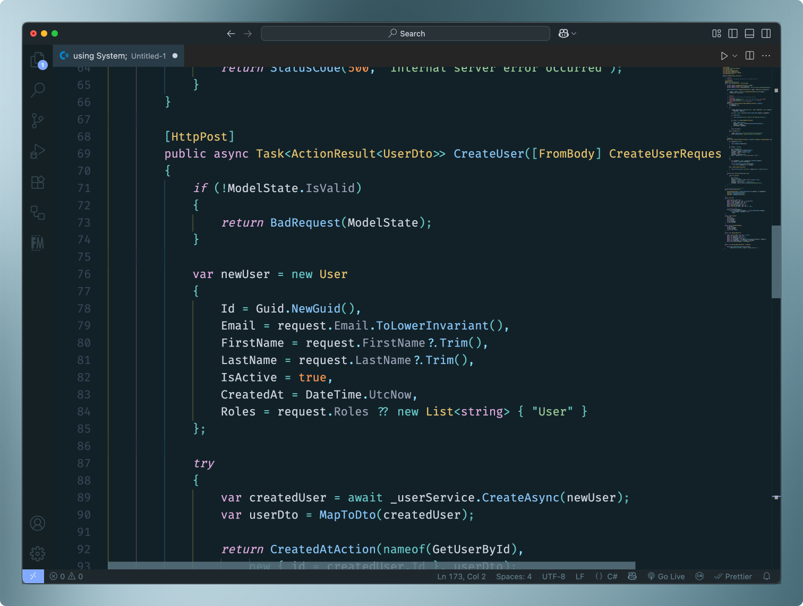
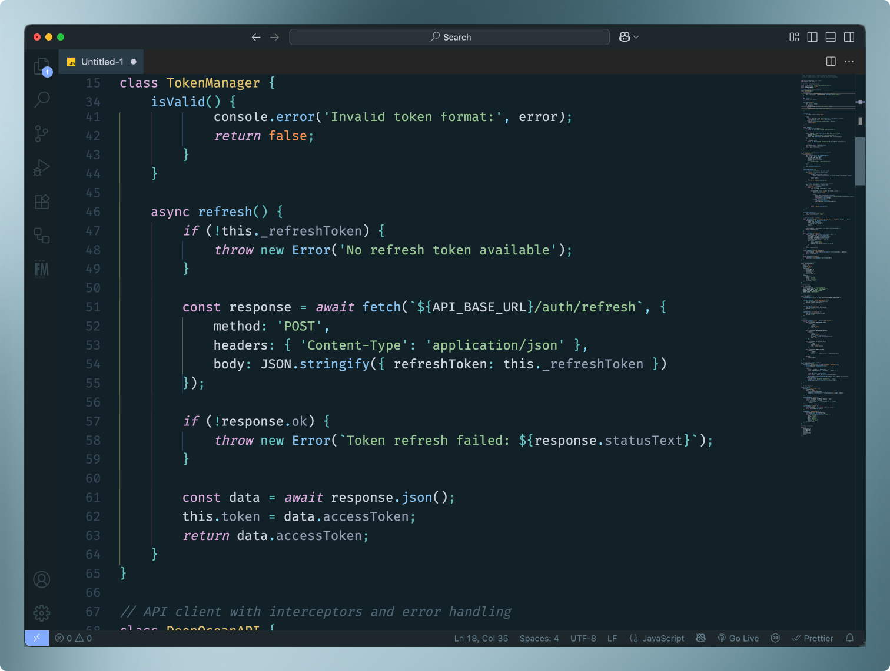
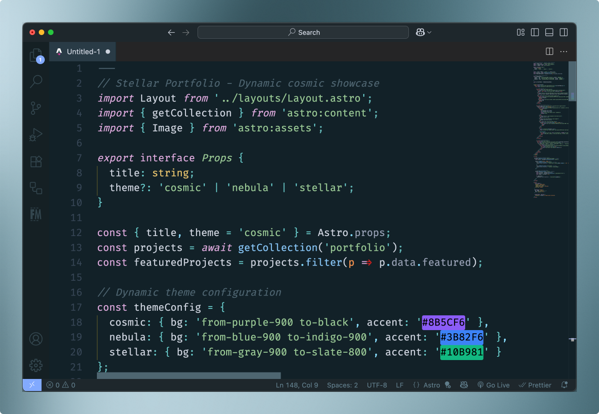
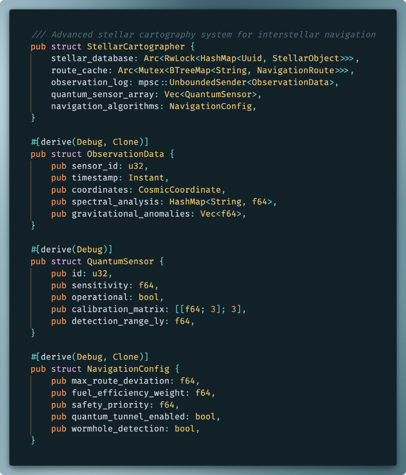
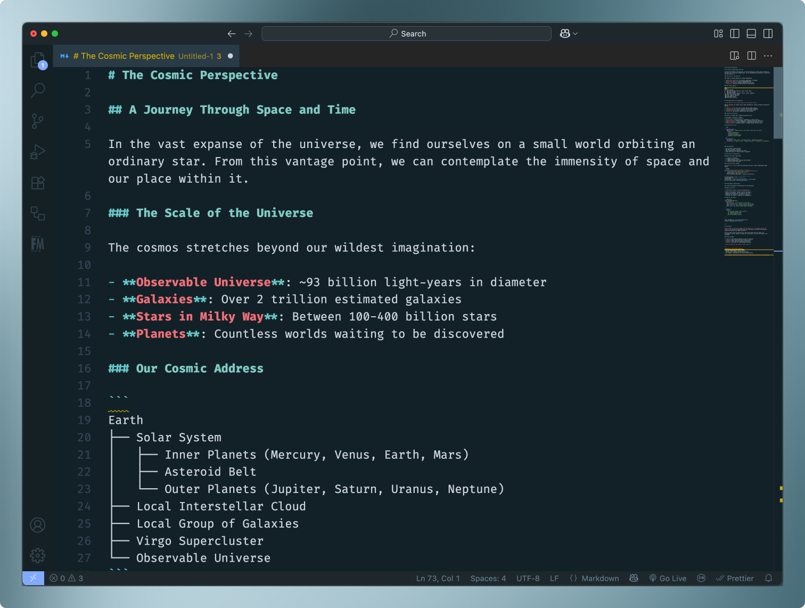

# 🦑 Space Kraken

**Unleash the cosmic tentacles of perfectly balanced syntax highlighting.**

A dark theme that wraps your code in the depths of space with a comfortable palette of colors. Designed for developers who appreciate both aesthetic beauty and functional clarity.

*(Space Kraken was created by an OLED screen user who doesn't always want to use 100% black backgrounds.)*

---

## 🚀 Features

- Curated colors that glow without intense contrast
- Intuitive file explorer and tab theming
- Selection highlights that flow naturally through your code
- It just looks good!

### 🌌 Cosmic Coding Experience
Immerse yourself in a carefully crafted space environment where every color serves a purpose. Every token type has its color in the *cosmic* hierarchy - from function calls to comments, all without overdoing the color palette or washing out in common colors.

### 👁️ OLED Friendly  
Deep space backgrounds **minimize OLED color contrast intensity** as the semi-vibrant accents shine without being too overwhelming.

### Language Support

Syntax highlighting for all major languages including:

- **C#** · **JavaScript** · **TypeScript** · **Python** · **Java** · **Go** · **Rust** · **HTML** · **CSS** · **JSON** · **Markdown** · **YAML** · **XML** *and more...*

---

## 📸 Screenshots

### **C# Development**

### **JavaScript/TypeScript**

### **Astro**

### **Rust**

### **Markdown**

---

## 🎨 Color Palette

| Element | Color | Purpose |
|---------|-------|---------|
| **Keywords** | `#dca9dc` | Stellar purple for language constructs |
| **Functions** | `#85c3f4` | Bright blue like distant stars |
| **Strings** | `#99c794` | Soft green like alien flora |
| **Numbers** | `#fb9551` | Warm orange like cosmic energy |
| **Comments** | `#4d6470` | Muted gray that fades into space |
| **Operators** | `#66c7c7` | Cyan like energy conduits |

---

## 🛸 Installation

### **Via VS Code Marketplace**
1. Open VS Code
2. Go to Extensions (`Ctrl+Shift+X`)
3. Search for "Space Kraken"
4. Click Install
5. Navigate to `File → Preferences → Color Theme`
6. Select **Space Kraken**

### **Manual Installation**
1. Download the `.vsix` file from [Releases](https://github.com/chanware/space-kraken-theme/releases)
2. Open VS Code
3. Run `Extensions: Install from VSIX...` from Command Palette
4. Select the downloaded file

---

## Tags

`#theme` `#dark-theme` `#vscode` `#oled` `#cosmic` `#space` `#kraken` `#syntax-highlighting` `#developer-tools` `#eye-strain` `#programming`

---

Made with 🦑 and cosmic dedication by Channing Brown.
*Embrace the void. Code with the Kraken!*
